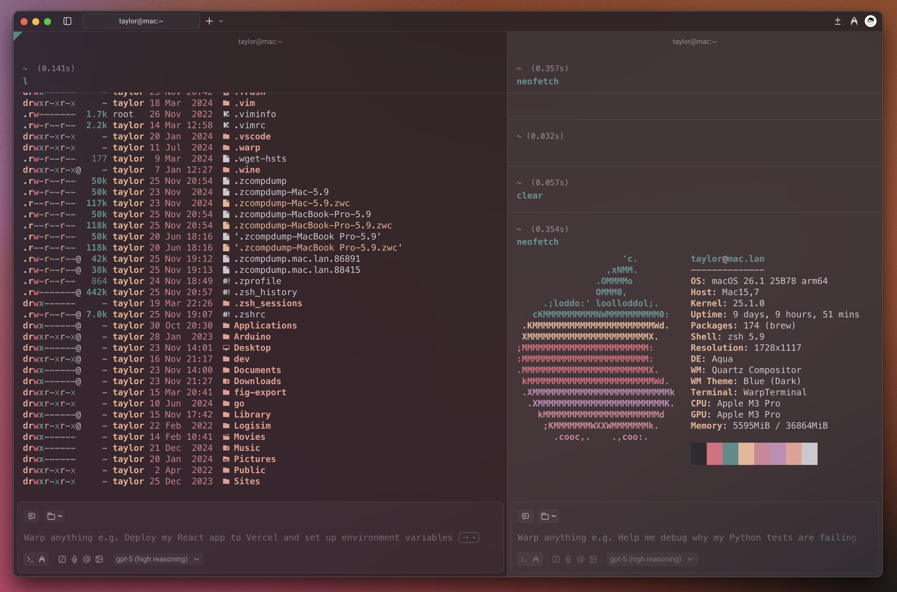

<p align="center">
    
    <h1 align="center">Corduroy for Warp Terminal</h1>
</p>

<p align="center">
    <b>Embrace vintage warmth, soft textures, and a touch of retro flair</b>
</p>

<p align="center">
    
</p>

<div align="center">

[](https://github.com/taysatte/corduroy-theme-warp)
&nbsp;
[](LICENSE.md)

</div>

## 📦 Installation

1. Create the themes directory if it doesn't already exist:

   ```bash
   mkdir -p ~/.warp/themes
   ```

2. Navigate to the themes directory and clone the repository:

   ```bash
   cd ~/.warp/themes && git clone https://github.com/taysatte/corduroy-theme-warp
   ```

3. Open Warp > Settings > Appearance > Themes, scroll all the way down to see the new Corduroy theme.

4. You might need to restart Warp for it to register the new theme as per the documentation.

   > **Note:** It may take several minutes for Warp to initially discover the new config directory. You can either wait or just restart the application. After that step, all future changes to `~/.warp/themes` directory will be reflected in Warp within seconds.

## 🎨 Gallery



---

<div align="center">

**Made with ☕️ and 🧵 by [Taylor Sattenfield](https://github.com/taysatte)**

[⭐ Star this repo](https://github.com/taysatte/corduroy-theme-warp) • [🐛 Report Bug](https://github.com/taysatte/corduroy-theme-warp/issues) • [💡 Request Feature](https://github.com/taysatte/corduroy-theme-warp/issues)

</div>
