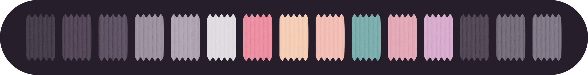
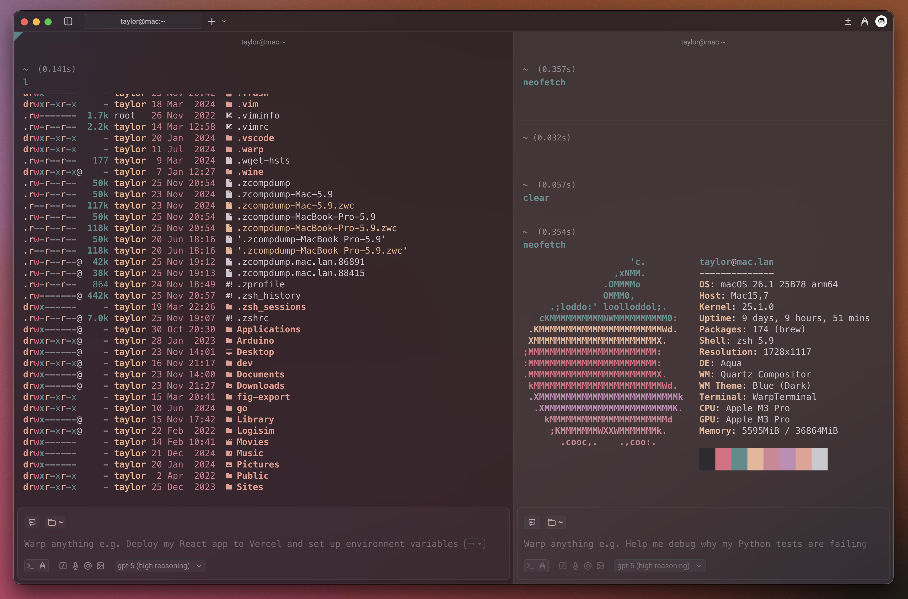

<p align="center">
    
    <h1 align="center">Corduroy for Warp Terminal</h1>
</p>

<p align="center">
    <b>Embrace vintage warmth, soft textures, and a touch of retro flair</b>
</p>

<p align="center">
    
</p>

<div align="center">

[](https://github.com/taysatte/corduroy-theme-warp)
&nbsp;
[](LICENSE.md)

</div>

## 📦 Installation

### macOS

1. Create the themes directory if it doesn't already exist:

   ```bash
   mkdir -p ~/.warp/themes
   ```

2. Navigate to the themes directory and clone the repository:

   ```bash
   cd ~/.warp/themes && git clone https://github.com/taysatte/corduroy-theme-warp
   ```

### Windows

1. Create the themes directory if it doesn't already exist:

   ```powershell
   New-Item -Path "$env:APPDATA\warp\Warp\data\themes" -ItemType Directory -Force
   ```

2. Navigate to the themes directory and clone the repository:

   ```powershell
   cd $env:APPDATA\warp\Warp\data\themes
   git clone https://github.com/taysatte/corduroy-theme-warp
   ```

   Themes live at `%APPDATA%\warp\Warp\data\themes\` (typically `C:\Users\<you>\AppData\Roaming\warp\Warp\data\themes\`).

### Finish setup

3. Open Warp > Settings > Appearance > Themes, scroll all the way down to see Corduroy and Corduroy Dark.

4. You might need to restart Warp for it to register the new theme as per the documentation.

   > **Note:** It may take several minutes for Warp to initially discover the new config directory. You can either wait or just restart the application. After that step, all future changes to the themes directory will be reflected in Warp within seconds.

## 🎨 Gallery



---

<div align="center">

**Made with ☕️ and 🧵 by [Taylor Sattenfield](https://github.com/taysatte)**

[⭐ Star this repo](https://github.com/taysatte/corduroy-theme-warp) • [🐛 Report Bug](https://github.com/taysatte/corduroy-theme-warp/issues) • [💡 Request Feature](https://github.com/taysatte/corduroy-theme-warp/issues)

</div>
